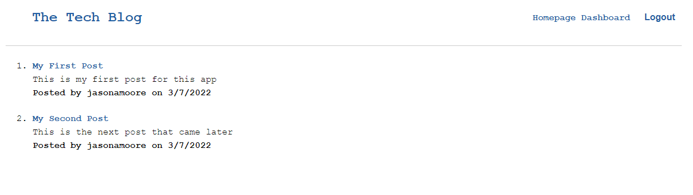

# The Tech Blog
  
  

  ## Description
  This application is Tech Blog where developers can add blog posts and comment on other developers posts. The application uses the MVC method and utilizes Handlebars.js, Sequelize, and Express-sessions packages.

  ## Table of Contents
  * [Installation](#installation)
  * [Usage](#usage)
  * [License](#license)
  * [Contributing](#contributing)
  * [Tests](#tests)
  * [Questions](#questions)
  
  ## Installation
  * Clone the repository from GitHub. 
  * Load Node.js, Express.js, Sequelize, Mysql2, Express-session, and Jest. 
  * Connect to the database using mysql -u root -r **password**. 
  * Source the schema.sql. 
  * Connect to the server by running Node Server in a terminal

  ## Usage
  Users are able to create a sign-in and once logged in the can view the Homepage and Dashboard. The user will able able to add, edit and delete posts. Please view the live Heroku link: https://moore4579-tech-blog.herokuapp.com

  

  ## License
  This project is license under MIT

  ## Contributing
  Follow installation instructions.

  ## Tests
  npm test

  ## Questions
  If you have any questions about this project, please contact me directly at jasonamoore@frontier.com. You can view more of my projects at https://github.com/jamoore4579.
  